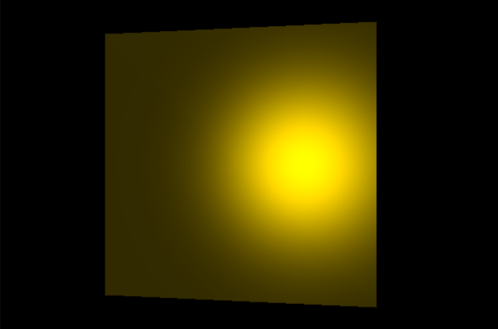
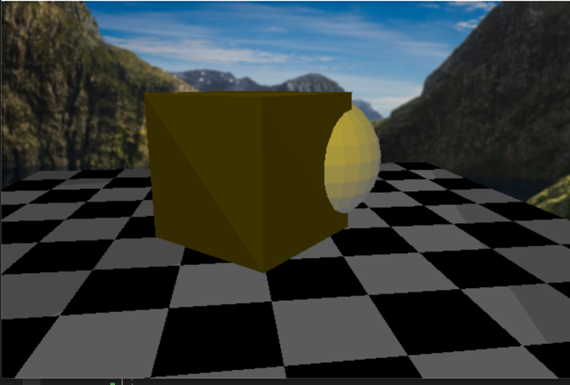

# Renderer
3D Renderer -> Rasteriser (RayTracer implemented minimally)

A 3D Renderer implemented from scratch using Win32 API and C++  
Not implemented for Linux OS 

# Outputs 
## Phong Shading 

	

  

## Shapes Rendering 

	

## Current Runnable Output 

	

  
This is work in progress personal project. 
